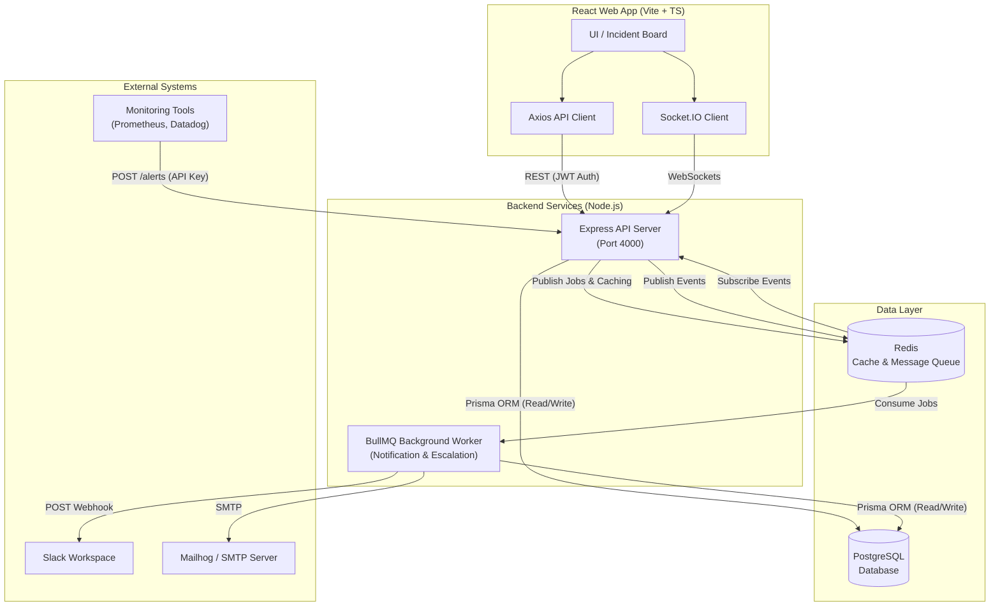
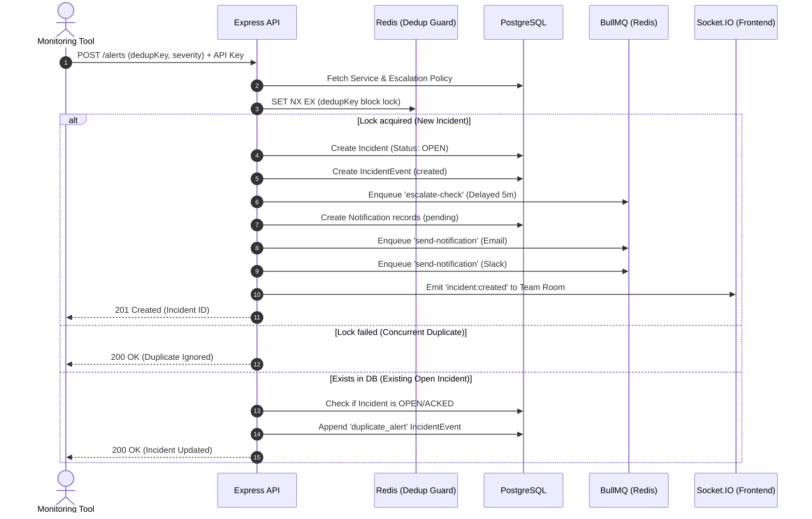
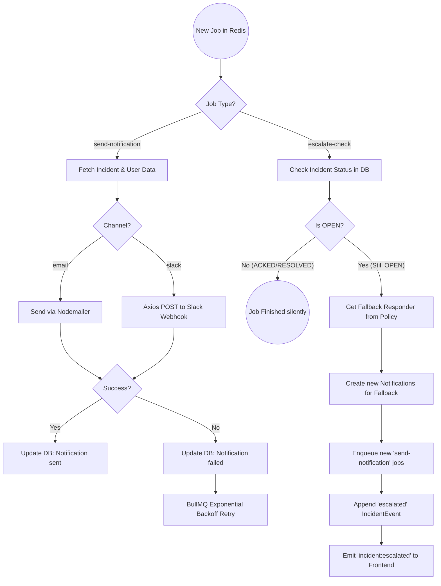
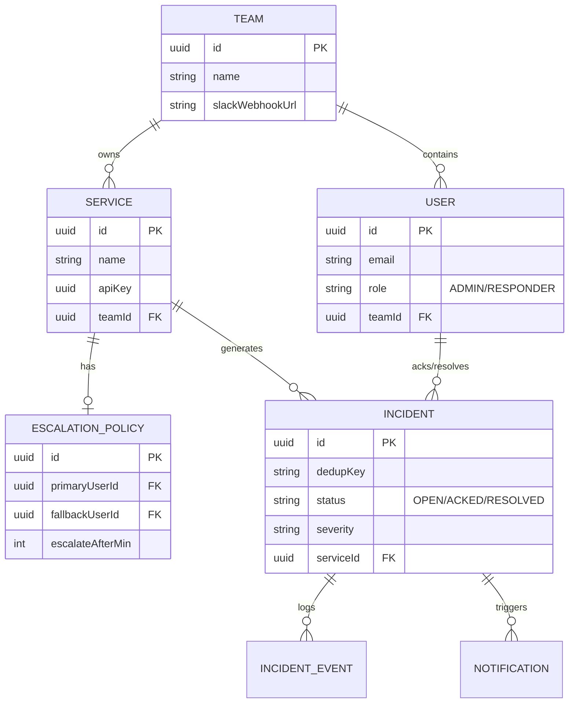

# OnCallX

A real-time incident management and alerting platform — a scoped-down PagerDuty/Opsgenie. External monitoring sources POST alerts to an ingestion API. Alerts are deduplicated, converted into incidents, and escalated to on-call engineers if unacknowledged within a configured window. Engineers acknowledge/resolve incidents from a real-time dashboard.

## Architecture

```
oncallx/
├── apps/
│   ├── api/       # Express REST + Socket.IO server (port 4000)
│   ├── worker/    # BullMQ worker (escalation + notification dispatch)
│   └── web/       # React + Vite dashboard (port 3000)
├── packages/
│   └── shared/    # Prisma client, Redis, BullMQ queues, types
└── prisma/        # PostgreSQL schema + migrations
```

## Quick Start (Docker Compose)

```bash
# 1. Clone the repo
git clone https://github.com/your-org/oncallx.git
cd oncallx

# 2. Copy env file
cp .env.example .env

# 3. Start all services
docker-compose up --build

# Services:
#   API:       http://localhost:4000
#   Dashboard: http://localhost:3000
#   Mailhog:   http://localhost:8025  (SMTP catcher UI)
```

The API will automatically run `prisma migrate deploy` on startup.

## Local Development (without Docker)

Prerequisites: Node.js 20+, PostgreSQL 16, Redis 7

```bash
# Install all workspace dependencies
npm install

# Copy and fill in your env
cp .env.example .env

# Run database migrations
npx prisma migrate dev --name init

# Generate Prisma client
npx prisma generate

# Start API (in one terminal)
cd apps/api && npm run dev

# Start Worker (in another terminal)
cd apps/worker && npm run dev

# Start Web (in another terminal)
cd apps/web && npm run dev
```

## Demo: Setting Up and Firing a Test Alert

### Step 1: Create a Team (direct DB or Prisma Studio)

```bash
# Open Prisma Studio to create a team and get its ID
npx prisma studio
```

Or insert directly:
```sql
INSERT INTO "Team" (id, name) VALUES ('550e8400-e29b-41d4-a716-446655440000', 'On-Call Team');
```

### Step 2: Create a Demo Admin User

```bash
curl -X POST http://localhost:4000/auth/register \
  -H "Content-Type: application/json" \
  -d '{
    "email": "admin@oncallx.dev",
    "password": "password123",
    "name": "Admin User",
    "teamId": "550e8400-e29b-41d4-a716-446655440000",
    "role": "ADMIN"
  }'
```

### Step 3: Create a Responder User

```bash
curl -X POST http://localhost:4000/auth/register \
  -H "Content-Type: application/json" \
  -d '{
    "email": "responder@oncallx.dev",
    "password": "password123",
    "name": "On-Call Engineer",
    "teamId": "550e8400-e29b-41d4-a716-446655440000",
    "role": "RESPONDER"
  }'
```

### Step 4: Log In to Get a JWT

```bash
curl -X POST http://localhost:4000/auth/login \
  -H "Content-Type: application/json" \
  -d '{"email": "admin@oncallx.dev", "password": "password123"}'
# Copy the accessToken
export TOKEN=<accessToken>
```

### Step 5: Create a Service (via Admin Panel or curl)

```bash
curl -X POST http://localhost:4000/services \
  -H "Content-Type: application/json" \
  -H "Authorization: Bearer $TOKEN" \
  -d '{"name": "Production API", "teamId": "550e8400-e29b-41d4-a716-446655440000"}'
# Copy the id and apiKey from the response
export SERVICE_ID=<id>
export API_KEY=<apiKey>
```

### Step 6: Set an Escalation Policy

Get user IDs first:
```bash
curl http://localhost:4000/teams/550e8400-e29b-41d4-a716-446655440000/users \
  -H "Authorization: Bearer $TOKEN"
```

Then set the policy:
```bash
curl -X POST http://localhost:4000/services/$SERVICE_ID/escalation-policy \
  -H "Content-Type: application/json" \
  -H "Authorization: Bearer $TOKEN" \
  -d '{
    "primaryUserId": "<admin-user-id>",
    "fallbackUserId": "<responder-user-id>",
    "escalateAfterMin": 1
  }'
```

### Step 7: Fire a Test Alert

```bash
curl -X POST http://localhost:4000/alerts \
  -H "Content-Type: application/json" \
  -H "X-Api-Key: $API_KEY" \
  -d '{
    "dedupKey": "disk-full-prod-01",
    "severity": "HIGH",
    "title": "Disk at 95% on prod-01"
  }'
```

The incident appears on the dashboard at http://localhost:3000 **within ~1 second**, live via WebSocket.

### Step 8: Verify Deduplication

Fire the same alert again immediately:
```bash
curl -X POST http://localhost:4000/alerts \
  -H "Content-Type: application/json" \
  -H "X-Api-Key: $API_KEY" \
  -d '{"dedupKey": "disk-full-prod-01", "severity": "HIGH"}'
# Response: 200, "Duplicate alert — existing incident updated"
# No new incident created in the DB.
```

### Step 9: Watch Escalation

If you set `escalateAfterMin: 1` and don't ack within 1 minute, the worker will escalate to the fallback user. Check Mailhog at http://localhost:8025 for the email notification.

## Running Tests

```bash
# All tests
npm test

# Watch mode
npx jest --watch

# Specific test file
npx jest apps/api/src/__tests__/dedup.test.ts
```

## API Reference

| Method | Path | Auth | Description |
|--------|------|------|-------------|
| POST | /auth/register | none | Create user |
| POST | /auth/login | none | Returns access + refresh token |
| POST | /auth/refresh | refresh token | Rotates refresh token |
| POST | /alerts | X-Api-Key | Ingest alert, dedup + incident creation |
| GET | /incidents | JWT | List incidents (cursor pagination, ?status=OPEN) |
| GET | /incidents/:id | JWT | Incident detail + event history |
| POST | /incidents/:id/ack | JWT, RESPONDER+ | Acknowledge incident |
| POST | /incidents/:id/resolve | JWT, RESPONDER+ | Resolve incident |
| POST | /services | JWT, ADMIN | Create service |
| POST | /services/:id/escalation-policy | JWT, ADMIN | Set escalation policy |
| PUT | /teams/:id/slack-webhook | JWT, ADMIN | Set Slack incoming webhook URL |
| GET | /teams/:id/users | JWT | List team members |
| WS | /ws | JWT (auth.token) | Real-time incident events |

## WebSocket Events

Connect with `socket.io-client` to `VITE_WS_URL` with `path: '/ws'` and `auth: { token: <accessToken> }`.

| Event | Direction | Payload |
|-------|-----------|---------|
| `incident:created` | server → client | `{ incident, serviceName }` |
| `incident:updated` | server → client | `{ incident }` |
| `incident:escalated` | server → client | `{ incidentId, fallbackUserId }` |

---

# OnCallX System Architecture

This document provides detailed Mermaid diagrams illustrating the architecture, data flow, and core workflows of the OnCallX incident management system.

## 1. High-Level Architecture
This diagram outlines the major components of the system, their interactions, and the underlying infrastructure (PostgreSQL, Redis, BullMQ).



---

## 2. Alert Processing & Incident Creation Workflow
This sequence diagram shows exactly what happens when a monitoring system triggers an alert, including deduplication and asynchronous job scheduling.



---

## 3. Escalation & Background Worker Flow
This flowchart details how the `worker` container processes background jobs, handles failures, and enforces escalation policies when an incident goes unacknowledged.



---

## 4. Database Schema (Entity Relationship Diagram)
A high-level view of how the tables in PostgreSQL are related to one another.


